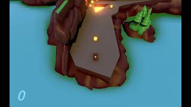

# VehicleProject

Introductory Unity Vehicle Project made in UTD Fundamentals Course

This game was created as a part of UTD's Animation and Game Fundamentals course. 
The models for the environment and player car were created in Maya, and the
introductory cutscene was modeled, rigged, animated, and lit/rendered in Maya
with Arnold. In Unity, fundamentals on Game and Level Design were applied to
create our mechanics in a sandbox level and then build the game level seen in
the video playthrough below. Mechanics and behaviors were created in code, and
the environment dressing was created through the use of tree and rock models
along with the use of particle effects and post processing, as well as the 
animation of the player car wheels and some trees in the background. Animation
was generated using Mechanim and code.

Presented is a link to a Youtube video demonstrating the level being played.

